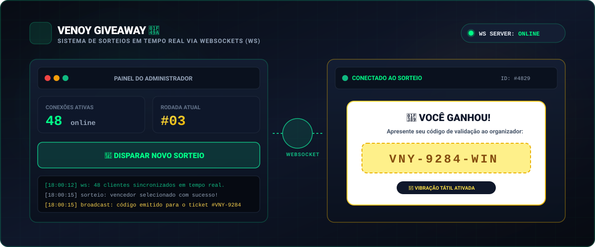

<div align="center">

# 🎁 venoyGiveway — Sorteios em Tempo Real 💚

<p align="center">
  
</p>

[](https://nodejs.org)
[](https://expressjs.com/)
[](https://github.com/websockets/ws)
[](./LICENSE)

<p align="center">
  <b>💚 Sistema de sorteios em tempo real via WebSockets com painel administrativo interativo.</b>
</p>

</div>

---

## 📌 Visão Geral

O **venoyGiveway** é uma solução para realização de sorteios e dinâmicas ao vivo baseada em **WebSockets nativos (`ws`)**. Criada para eventos presenciais ou transmissões online, a plataforma conecta instantaneamente todos os participantes ao painel do organizador:

1. **Painel do Administrador (`/admin`)**: O organizador acompanha a quantidade exata de participantes conectados em tempo real e dispara o sorteio com um clique.
2. **Interface do Participante (`/`)**: Cada participante acessa a página e aguarda. No momento do disparo, os dispositivos são notificados simultaneamente com feedback visual e tátil (vibração no smartphone).

---

## ✨ Principais Funcionalidades

- ⚡ **Comunicação Bidirecional Ultra-Rápida**: Conexão permanente e de baixa latência através do protocolo WebSocket.
- 👥 **Contador de Participantes ao Vivo**: O admin visualiza o número exato de pessoas prontas para o sorteio.
- 🎫 **Ticket Digital do Ganhador**: O sorteado recebe um ticket estilizado na tela com código exclusivo de validação para conferência.
- 📳 **Feedback Tátil (Haptic Vibration)**: Se o participante estiver no celular, o aparelho vibra ao ser sorteado.
- 🛡️ **Painel de Controle Centralizado**: Simplicidade operacional para gerenciar múltiplas rodadas consecutivas de sorteios.

---

## 🏗️ Arquitetura de Comunicação WebSocket

```text
[ Cliente Web / Mobile 1 ] ───┐
[ Cliente Web / Mobile 2 ] ───┼── (WebSocket Bidirecional) ──> [ Servidor ws / Express ]
[ Cliente Web / Mobile N ] ───┘                                        │
                                                                       │ (Controle & Broadcast)
[ Painel Admin (/admin) ]  ───────────────────────────────────────────┘
```

---

## 📂 Arquitetura de Pastas

```text
venoyGiveway/
├── public/                          # Front-end da aplicação
│   ├── assets/
│   │   ├── css/styles.css           # Estilos das interfaces (admin, cliente e ticket)
│   │   └── images/
│   │       ├── preview-banner.svg   # Banner visual oficial
│   │       └── venoystudio.png      # Logomarca Venoy Studio
│   ├── js/
│   │   ├── admin.js                 # Lógica de conexão e disparo do admin
│   │   ├── client.js                # Lógica de escuta e renderização do participante
│   │   └── config.js                # Endereço e porta do servidor WebSocket
│   ├── admin.html                   # Página do painel de controle
│   └── index.html                   # Página pública do sorteio
├── server.js                        # Servidor HTTP Express e WebSocket Server (ws)
├── package.json                     # Metadados e dependências
└── README.md                        # Documentação do projeto
```

---

## 🚀 Como Executar Localmente

### Pré-requisitos
- **Node.js** (versão 18 ou superior)
- Gerenciador **npm** ou **yarn**

### Instalação e Execução

```bash
# 1. Clonar o repositório
git clone https://github.com/paulovenoy/venoyGiveway.git

# 2. Entrar no diretório
cd venoyGiveway

# 3. Instalar as dependências
npm install
# ou
yarn install

# 4. Iniciar o servidor
npm start
# ou
yarn start
```

### Acessos
- **Página de Participação**: `http://localhost:3000`
- **Painel Administrativo**: `http://localhost:3000/admin`

> 💡 **Como testar**: Abra várias abas do navegador em `http://localhost:3000` e abra uma aba em `http://localhost:3000/admin`. Observe o contador subir e clique em **Realizar Sorteio** para ver apenas uma das abas ser contemplada com o ticket premiado!

---

<div align="center">
  <sub>Desenvolvido com 💚 por <b>Paulo Venoy</b> • Venoy Studio</sub>
</div>
